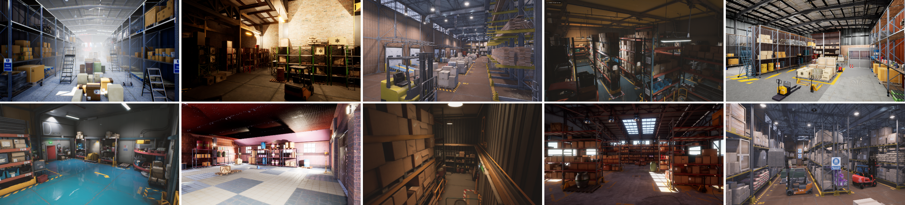
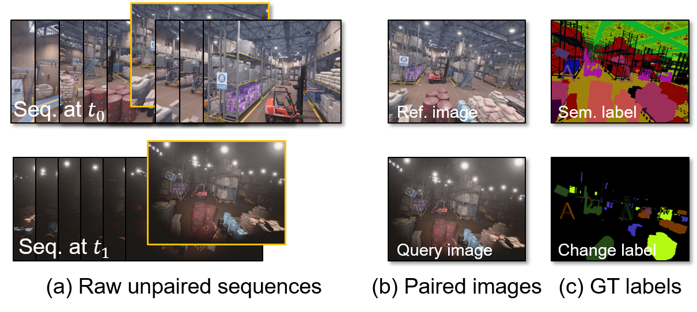
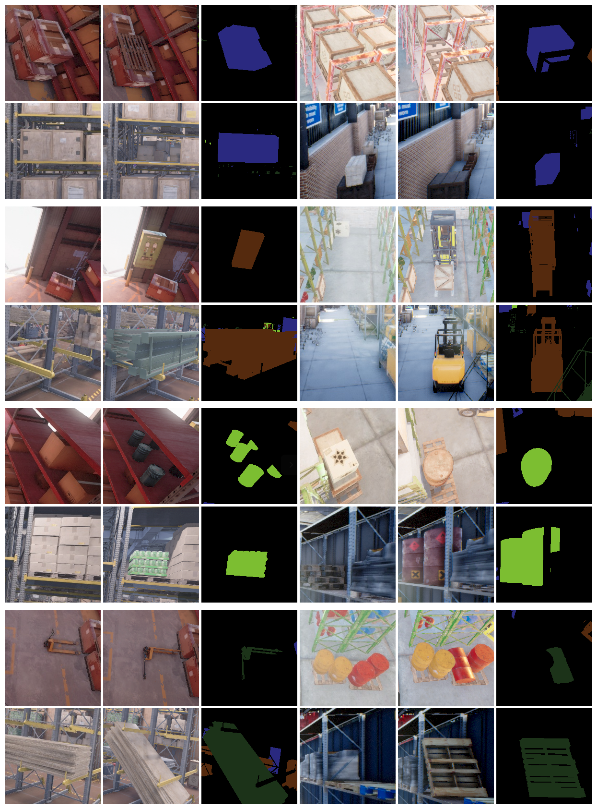

# ChangeSim: Towards End-to-End Online Scene Change Detection in Industrial Indoor Environments

<iframe width="800" height="450" src="https://www.youtube.com/embed/3zMMWg40WZY" frameborder="0" allow="accelerometer; autoplay; clipboard-write; encrypted-media; gyroscope; picture-in-picture" allowfullscreen></iframe>


## Recent updates (Under construction)
- [x] Dataset download links (March 10, 2021)
- [ ] Documentation for the dataset 
- [ ] A Tutorial for the visualization of ChangeSim 
- [ ] A Tutorial for the data collection using Airsim and UE4)


## Abstract

We present a challenging dataset, ChangeSim, aimed at online scene change detection (SCD) and more. The data is collected in photo-realistic simulation environments with the presence of environmental non-targeted variations, such as air turbidity and light condition changes, as well as targeted object changes in industrial indoor environments. By collecting data in simulations, multi-modal sensor data and precise ground truth labels are obtainable such as the RGB image, depth image, semantic segmentation, change segmentation, camera poses, and 3D reconstructions. While the previous online SCD datasets evaluate models given well-aligned image pairs, ChangeSim also provides raw unpaired sequences that present an opportunity to develop an online SCD model in an end-to-end manner, considering both pairing and detection. Experiments show that even the latest pair-based SCD models suffer from the bottleneck of the pairing process, and it gets worse when the environment contains the non-targeted variations. 

## Citation
If you find this project helpful, please consider citing this project in your publications. The following is the BibTeX of our work.

```bibtex
@techreport{park2021changesim,
author = {Park, Jin-Man and Jang, Jae-hyuk, and Yoo, Sahng-Min and Lee, Sun-Kyung and Kim, Ue-hwan and Kim, Jong-Hwan},
title = {ChangeSim: Towards End-to-End Online Scene Change Detection in Industrial Indoor Environments},
number = {arXiv:2103.05368 [cs.CV]},
month = {March},
year = {2021},
institution = {ArXiV},
url = {https://arxiv.org/abs/2103.05368},
}
```

## Download

The dataset can be downloaded [here](https://github.com/SAMMiCA/ChangeSim) with the description.


## Dataset features

### Diverse and Realistic Indoor Industrial Domain

 

### Raw Data for the Whole Pipeline for Online Change Detection

 {: width="80%"}
 
### Rich Changes with Novel Multi-class Change Labels

 {: width="80%"}

### Controllable Environmental Variations

 {: width="80%"}


## Data acquisition pipeline


## Support or Contact

Jin-Man Park - (jmpark [at] rit [dot] kaist [dot] ac [dot] kr)

Jae-Hyuk Jang - (jhjang [at] rit [dot] kaist [dot] ac [dot] kr)


## Acknowledgments

This work was supported by Institute for Information & communications Technology Promotion (IITP) grant fundedby the Korea government (MSIT) (No.2020-0-00440, Devel-opment of artificial intelligence technology that continuouslyimproves itself as the situation changes in the real world).
