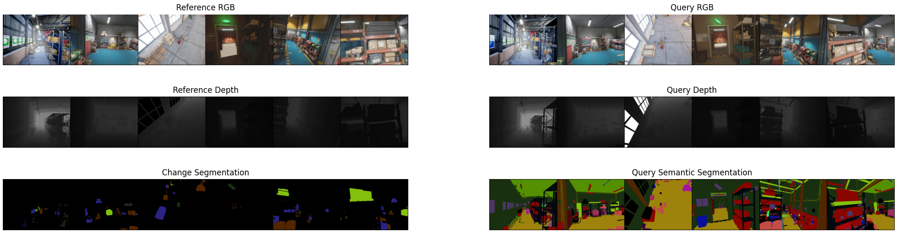

# Data directory structure
```
[Folder Name]
      |
      --- Reference
             |
             --- Ref_Seq_Train
             |        |
             |        +-- Warehouse_0
             |        .         
             |        +-- Warehouse_5
             |
             --- Ref_Seq_Test
             |        |
             |        +-- Warehouse_6
             |        .
             |        +-- Warehouse_9
            
          Query
             |
             +-- Query_Seq_Train
             +-- Query_Seq_Test
            
          script
             |
             --- visualization.py
             --- dataloader.py
            
          utils
             |     
             --- Object_Labeling.py
             --- dict_indexing.py
             --- idx2color.txt
```


# Visualization
```
python visualization.py
```
<p align="center"></p>


# Dataloader


```python
import torch
from dataloader import ChangeSim

# Number of target change detection class
num_class = 5

train_data = ChangeSim(crop_size=(320, 240), set='train', num_classes=num_class)
train_loader = torch.utils.data.DataLoader(train_data, batch_size=6, shuffle=True)
test_data = ChangeSim(crop_size=(320, 240), set='test', num_classes=num_class)
test_loader = torch.utils.data.DataLoader(test_data, batch_size=6, shuffle=False)
```
