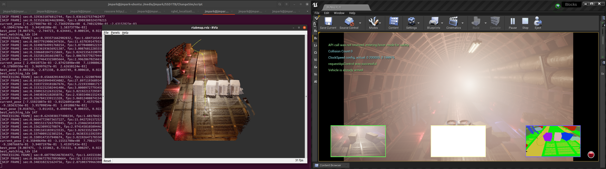

# DIY Data Collection
**change detection dataset collection implemented in Airsim + Unreal Engine + ROS environment.**


## Environment Summary

 - Ubuntu 20.04 
 - ROS Noetic
 - virtualenv with Python 3.8+
 - [Airsim](https://github.com/microsoft/AirSim) (included in this repo.)
 - UnrealEngine 4.25 (If you want to use UE4.26 or higher, you need to pull the latest official airsim repo)
 - Pytorch 1.7.0+
 
 (may also work in Ubuntu 18.04 with ROS Melodic, but you need to modify installation scrip by yourself.)
 
 # Setup
 
  **0. Setup your virtualenv and install python packages**
   - Create Python 3.8 env.
     ``` 
     pip3 install virtualenv
     python -m virtualenv venv
     virtualenv venv --python=python3.8
     source venv/bin/activate
     pip install future torch torchvision
     ```
    
 **1. Install ROS Noetic**
  - [official installation link](http://wiki.ros.org/noetic/Installation/Ubuntu) 
  - Trouble-shooting:
    - gcc error:
    
    ```
    sudo add-apt-repository ppa:ubuntu-toolchain-r/test
    sudo apt-get update
    sudo apt-get install gcc-8 g++-8
    gcc-8 --version
    ```
    - Cmake version error:
    
      Download and build latest version of Cmake [here](https://snowdeer.github.io/linux/2018/04/10/upgrade-cmake/https://cmake.org/download/).
   
 
 **2. Install Unreal Engine 4(UE4) on Linux**
  - Asumming that you have installed NVIDIA graphics driver and cuda toolkit 10.2, please follow the instructions below.
  - [official installation link](https://docs.unrealengine.com/ko/Platforms/Linux/BeginnerLinuxDeveloper/SettingUpAnUnrealWorkflow/index.html) 
    (You are required to register for an Epic Games Account.)
    ```
    # go to the folder where you clone GitHub projects
    git clone -b 4.25 https://github.com/EpicGames/UnrealEngine.git
    cd UnrealEngine
    ./Setup.sh
    ./GenerateProjectFiles.sh
    make
    
    sudo apt -y install vulkan-utils
    ```
  - Run UE4(it takes about 15 minutes for the first run):
    ```
    ./UnrealEngine/Engine/Binaries/Linux/UE4Editor
    ```
    
 
 **3. Install Airsim**
  - [official installation link](https://microsoft.github.io/AirSim/build_linux/#pre-build-setup) 
    ```
    ./install_airsim.sh
    ```
  - Trouble-shooting:
    - gcc error:
    ```
    catkin build -DCMAKE_C_COMPILER=gcc-8 -DCMAKE_CXX_COMPILER=g++-8
    ```
    - AttributeError: 'module' object has no attribute 'Interpreter'
    ```
    pip uninstall em
    pip install empy
    ```
    
    - python syntax error
    ```
    pip install git+https://github.com/catkin/catkin_tools.git
    ```
    
    
 **4. Setup your unreal environment**
   - We do not recommend setting a new UE4 project folder (that method sometimes causes a lot of errors). 
     Instead, it is recommended to use the already set Blocks folder.
     (See [here](https://microsoft.github.io/AirSim/unreal_custenv/) if you want to set up a new UE4 project folder.)
   - Use unreal env. from [Electric-Tunnel-Dataset](https://github.com/SAMMiCA/Scenario1-ElectricTunnel-Dataset).
     ```
     # Duplicate Blocks Env as My_Env
     cp -r Airsim/Unreal/Environments/Blocks Airsim/Unreal/Environments/My_Env
     ```
     BUY or Download a map from [UE4 Marketplace](https://www.unrealengine.com/marketplace/ko/store and unzip it.
     
     Then, from the unzipped source code, merge `Contents` folder into `Airsim/Unreal/My_Env/Contents`. 
   

 
 **6. Install RTABMAP and other prerequisites**
```
sudo apt install ros-noetic-rtabmap* ros-noetic-ros-numpy ros-noetic-perception-pcl python-rospy
```
     
   - Trouble-shooting:
     
       - No module named sip
    
         install sip mannually following [here](https://wiki.debianusers.or.kr/index.php?title=PyQt_%EC%84%A4%EC%B9%98%ED%95%98%EA%B8%B0#SIP_.EC.84.A4.EC.B9.98)
       

# How-to 
## Reference Sequence
### Preparation
1. Open the downloaded map
   - find Content folder in UE4Editor's content browser
2. Make a trajectory in the map
   - place assets (such as sphere) and name them waypoint_a_1, waypoint_a_2, etc.
   - select all waypoints and make them invisible and no colision
       - Details -> Rendering -> Visible -> unchecked
       - Details -> Collision -> Collision Presets -> No collision
   - save
  
### Data collection 
[Video1](https://youtu.be/8D17ImUBJ-M) [Video2](https://youtu.be/jL_nqfV0syA)
1. Play map (alt+P)
2. Run sensor publisher
   ```bash
   # rgb, depth_registered, camera info, sem_seg are published
   python publish_sensor_data.py 
   ```
3. Run trajectory follower
   ```bash
   python follow_trajectory_forward_multirotor.py 
   # if successful, the multirotor will be hovering; otherwise ctrl+c and run again.
   ```
5. Run RTABMAP
    ```bash
   roslaunch rgbd_mapping.launch 
   ```
7. Start moving 
   - press enter in the trajectory following script
9. End and save 
   ```bash
   # stop RTABMAP by pressing ctrl+c whenever you want   
   # backup
   cp ~/.ros/rtabmap.db SAVE_PATH
   # extract images
   rtabmap-databaseViewer ~/.ros/rtabmap.db
   Yes-> File -> Extract Images -> OK
   # save path should be like this
   /media/jmpark/SSD1TB/changesim_dataset/Mapping/Bunker/Room_0/Seq_0/raw
   # File -> Extract poses -> g2o -> OK -> Camera -> OK 
   # save path should be like this
   /media/jmpark/SSD1TB/changesim_dataset/Mapping/Bunker/Room_0/Seq_0/raw/poses.g2o
   ```

## Query Sequence
### Preparation
[Video3](https://youtu.be/teKCd_fd_LY)
1. make a copy of the map (now we call the original one as map_t0 and the coppied one map_t1, respectively) 
2. Open map_t1 make changes

    **new**
  
    a. Place a new actor in any place
    
    b. Name the actor `blabla_new`
    
    **missing**
  
    a. Select an actor you want to make disappear
    
    b. Name the actor `blabla_missing`
    
    c. Uncheck both Rendering->Render in main path, Render in depth path
    
    **replaced**

    a. Select an actor you want to make replaced

    b. Remove the actor

    c. Place a new actor to the same place, and name it as `blabla_replaced`

    **rotated**

    a. Select an actor you want to make rotated

    b. Rotate the actor

    c. Name the actor `blabla_rotated`


3. Save the map (ctrl+s) and render lights only (ctrl+shift+;)

### Data collection
1. Play map (alt+P)
2. Run sensor publisher
   ```bash
   # rgb, depth_registered, camera info, sem_seg are published
   python publish_sensor_data.py --change_labeling --enable_dust
   ```
3. Run trajectory follower
   ```bash
   python follow_trajectory_forward_multirotor.py 
   # if successful, the multirotor will be hovering; otherwise ctrl+c and run again.
   ```
5. Run RTABMAP
    ```bash
   roslaunch rgbd_localization.launch 
   ```
6. Start collection
   ```bash
   python cloud_to_img.py --save_path /media/jmpark/SSD1TB/changesim_dataset/Localization/Bunker/Room_0/Seq_0
   ```
8. Start moving 
   - press enter in the trajectory following script

9. End and save 
   ```bash
   # stop RTABMAP by pressing ctrl+c whenever you want   

Youtube Link TBU.

# Visualization
```
python visualization.py
```
<p align="center"></p>


# Dataloader


```python
import torch
from dataloader import ChangeSim

# Number of target change detection class
num_class = 5

train_data = ChangeSim(crop_size=(320, 240), set='train', num_classes=num_class)
train_loader = torch.utils.data.DataLoader(train_data, batch_size=6, shuffle=True)
test_data = ChangeSim(crop_size=(320, 240), set='test', num_classes=num_class)
test_loader = torch.utils.data.DataLoader(test_data, batch_size=6, shuffle=False)
```
